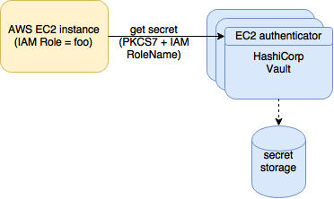

## get vault secret
This is a simple tool helps to use AWS EC2 credential to access HashiCorp Vault data

## How it works


### Setup IAM
1. Create a IAM role `vault_test-ec2-role`, capture the IAM instance profile ARN
2. Launch an EC2 instnace with above IAM role

### Setup Vault
Create policy for accessing resources, and associate IAM role to the policy

```
Enable vault EC2 authentication
> vault auth-enable aws-ec2
```

```
# File: dev_policy.hcl
path "secret/*" {
  policy = "read"
}

path "auth/token/lookup-self" {
  policy = "read"
}
```

```
create policy document
> vault policy-write dev_policy dev_policy.hcl

associate policy with IAM role  (Note that you should capture instnace profile ARN here)
> vault write auth/aws-ec2/role/nevec-admin-ec2-role bound_iam_role_arn=arn:aws:iam::your_account_number:instance-profile/vault_test-ec2-role policies=dev_policy
```
## Usage
Install get_vault_secret on client box
```
> go get github.com/wcpan/get_vault_secret
```

Put secret key/valut to vault
```
> vault secret/foo_key value="top_secret"
```

```
On EC2 instance with an IAM role has permission to access vault secret
> get_vault_secret foo_key
top secret
```

## Development
```
Install required go packages
> make bootstrap

Release, make sure github API token is set in environment varialbe
export GITHUB_TOKEN="YOUR_TOKEN"
> make build release
```

## Reference
1. <a href="https://www.vaultproject.io/docs/auth/aws-ec2.html">Vault EC2 Auth backend</a>
2. <a href="https://godoc.org/github.com/hashicorp/vault/api">Vault Go API</a>
3. <a href="https://godoc.org/github.com/aws/aws-sdk-go/aws/ec2metadata">AWS metadata Go API</a>
